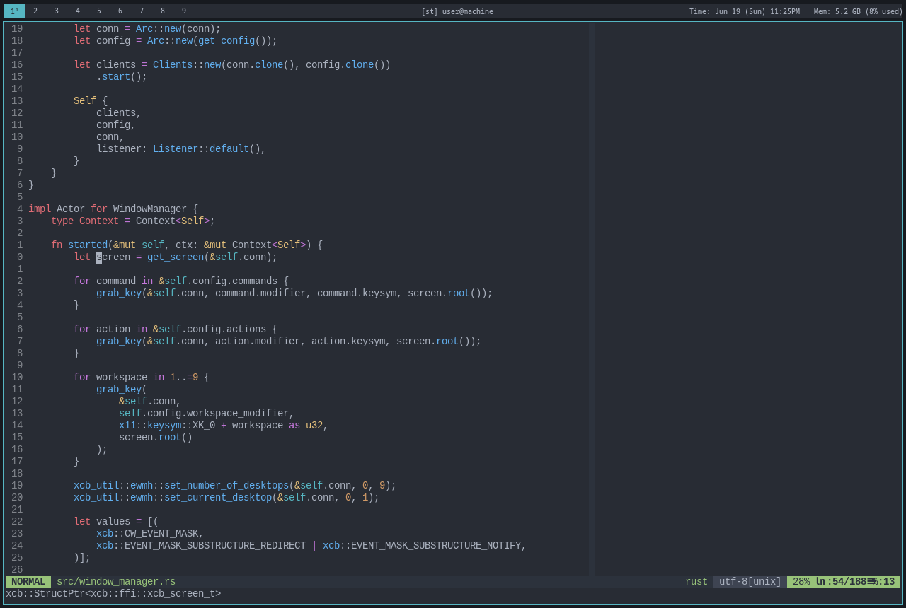

# mwm
My window manager that is a work in progress. Currently hacky

# Installation
Clone this repo then:
```
cargo build --release
```
Put the binary in your path, then add this to your `xinitrc`:
```
exec mwm
```

# Configuring

There are config.toml files in the `src` and `statusbar` directories
that you can customize. This should eventually read from `~/.config`
but right now it reads from the project directory.

# Screenshot


