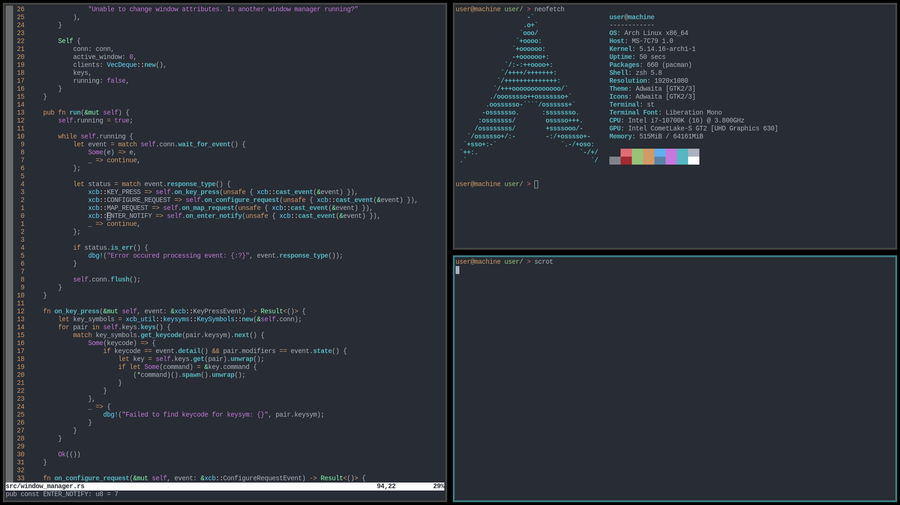

# mwm 
My window manager that is a work in progress. Currently hacky

# Installation
Clone this repo then:
```
cargo build --release
```
Put the binary in your path, then add this to your `xinitrc`:
```
exec mwm
```

# Configuring

In the `main.rs` file edit the config struct.
```rust
let config = crate::config::Config {
    keys: key_map!(
        (
            KeyPair { // If press alt-j then move window forward
                modifiers: xcb::MOD_MASK_1 as u16, // Normally the alt key
                keysym: x11::keysym::XK_j,
            },
            Handler {
                command: None,
                event: Some(Event::Forward),
            }
        ),
        (
            KeyPair { // If press alt-p then open st (suckless.org simple terminal)
                modifiers: xcb::MOD_MASK_1 as u16,
                keysym: x11::keysym::XK_p,
            },
            Handler {
                command: Some(Box::new(|| Command::new("st"))),
                event: None,
            }
        )
    )
};
```

# Planned features
- Plugin system
- Multithreading (can be useful in certain cases)
- Status bar
- EWMH compliant
- Workspaces
- Customizable layouts

# Screenshot


