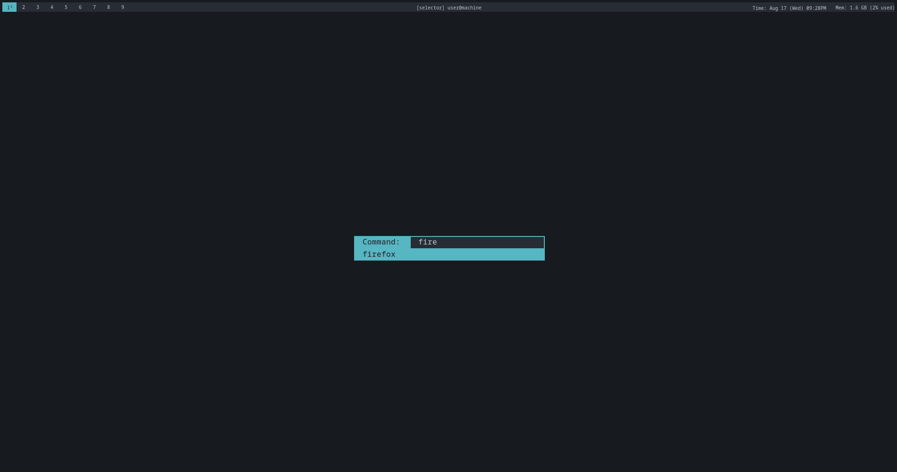

# mwm
My window manager that is a work in progress. Currently hacky

## Wayland support
I'm currently working on a Wayland implementation, find it in the [wayland](https://github.com/monroeclinton/mwm/tree/wayland) branch.

# Installation
Clone this repo then:
```
make install
```
This will install the binaries in `/usr/local/bin`. Then add this to your `xinitrc`:
```
exec mwm
```

# Configuring

There are config toml files in the `src` and `statusbar` directories
that you can customize.

You can make a symlink to these files in `~/.config/mwm/`.

# Screenshots



